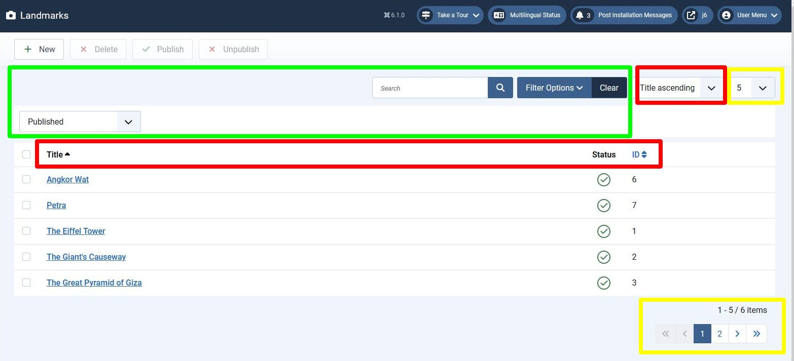
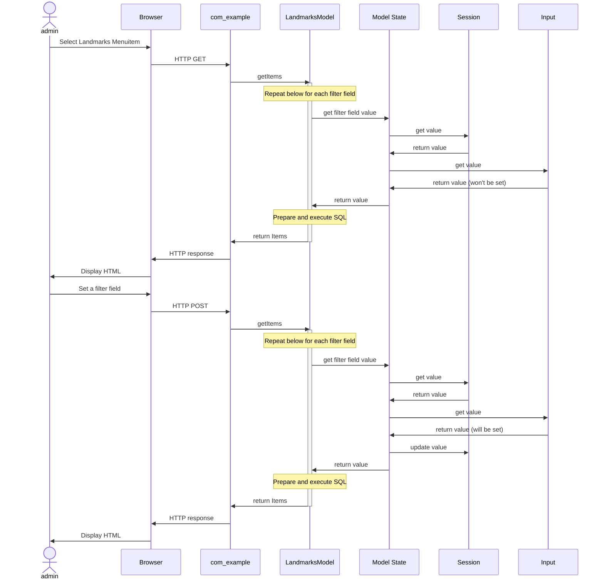

## Introduction

In this step we enhance the administrator landmarks page to provide:

- filtering - the set of records displayed can be filtered by a search string or by a published state

- pagination - splitting the display of records into pages, with a maximum number per page

- column ordering - selecting the column for ordering of records, and the direction (ascending/descending) within that column



The above screenshot of the enhanced landmarks form displays the additional functionality which this step provides:

- green rectangle - the filter options provide a search box and a published state selector, 
as well as a button to clear the filtering,

- yellow rectangles - the input element at the top allows the administrator to select how many rows should be displayed,
plus the footer shows the pagination information,

- red rectangles - there are two mechanisms for defining the column ordering - 
the select box at the top, and by selecting the column headers.

These 3 aspects are grouped into a single tutorial step because they all use the same filter form for implementation.
Of course, in your own extension you can choose which aspects to implement - each aspect can be implemented individually.

The code is available at [com_example step 12](https://github.com/joomla/manual-examples/tree/main/component-tutorial/step11_filter_form).

## Learning Points

Filter Form

Field Groups

Model State

## Filter Form

The key new source file in this step is the filter form definition:

```php title="administrator/components/com_example/forms/filter_landmarks.xml"
<?xml version="1.0" encoding="UTF-8"?>
<form>
    <fields name="filter">
        <field
            name="search"
            type="text"
            inputmode="search"
            label="COM_EXAMPLE_FILTER_SEARCH_LABEL"
            description="COM_EXAMPLE_FILTER_SEARCH_DESC"
            hint="JSEARCH_FILTER"
        />
        <field
            name="published"
            type="status"
            label="JOPTION_SELECT_PUBLISHED"
            class="js-select-submit-on-change"
            extension="com_example"
            optionsFilter="*,0,1"
            >
            <option value="">JOPTION_SELECT_PUBLISHED</option>
        </field>
    </fields>
    <fields name="list">
        <field
            name="fullordering"
            type="list"
            label="JGLOBAL_SORT_BY"
            class="js-select-submit-on-change"
            default="id ASC"
            validate="options"
            >
            <option value="">JGLOBAL_SORT_BY</option>
            <option value="title ASC">JGLOBAL_TITLE_ASC</option>
            <option value="title DESC">JGLOBAL_TITLE_DESC</option>
            <option value="id ASC">JGRID_HEADING_ID_ASC</option>
            <option value="id DESC">JGRID_HEADING_ID_DESC</option>
        </field>
        <field
            name="limit"
            type="limitbox"
            label="JGLOBAL_LIST_LIMIT"
            default="5"
            class="js-select-submit-on-change"
        />
    </fields>
</form>
```

As you can see there are 4 field definitions:

- 2 filter fields for the search input field and the field to select the published state

- a field to specify the column ordering

- a field to specify the pagination limit (ie maximum number of records per page)

:::note
  The column ordering and pagination limit fields are also known loosely as "filter fields"
:::

There are several things which you need to get right to get the filter form to work correctly.

**Filename** The file must be called "filter_\<viewname\>.xml" (so "filter_landmarks.xml" for us),
and be placed in the administrator forms folder. 
This enables Joomla to find and load the XML file for us, which we'll see when we look at the Model code.

**Field Groups** The tag `<fields>` specifies a field group. 
Notice that the 2 filter fields are within one field group, and the ordering and pagination fields within another.
Joomla expects these fields to be enclosed within these groups: 

- it will access the fields via the API to get the groups (eg [Form getGroup](cms-api://classes/Joomla-CMS-Form-Form.html#method_getGroup))

- enclosing the fields within field groups means that the POST arising from the form submission 
will have these fields sent in array format, based on the `name` attribute of each. So the POST parameters will be:

  - filter\[search\], filter\[published\]

  - list\[fullordering\], list\[limit\]

You can read about field groups in [Field Groups](../../../general-concepts/forms/manipulating-forms.md#field-groups).

**name attributes** The `name` attribute of the search filter, column ordering and pagination fields
must be called "search", "fullordering" and "limit".
For other filter fields the `name` attribute must match the column name in the database table.
At this stage we have only the "published" field, but we will introduce others later.

**type attributes** The `type` attribute defines the type of the Joomla [Standard Field](../../../general-concepts/forms-fields/standard-fields/index.md).
We used the [Text field](../../../general-concepts/forms-fields/standard-fields/text.md)
and [List field](../../../general-concepts/forms-fields/standard-fields/list.md) in our form for editing a Landmark,
so the new ones are [Status field](../../../general-concepts/forms-fields/standard-fields/status.md) and
[Limitbox field](../../../general-concepts/forms-fields/standard-fields/limitbox.md).

In the landmark edit form we used a List field type to capture the published state, and here we're using a Status field type instead - you can use either.
As we're using the Status field type here we specify the `optionsFilter` attribute to limit the choice to \* (All), 0 (unpublished) or 1 (published),
and these options are merged with the `<option value="">JOPTION_SELECT_PUBLISHED</option>`
which outputs the "- Select Status -" option as the first entry in the select box.

**class attributes** The `class` attribute (which will map to the CSS class attribute of the HTML input element) is mostly set to "js-select-submit-on-change".
This means that the Joomla JavaScript code will set an onChange event against that HTML element,
and will submit the form when the value of the element changes.
The "search" field isn't submitted on change, but rather whenever the administrator presses the button displaying the search icon,
or whenever he/she presses the Enter key on a keyboard.

## Overview Sequence and Model State

When any of the filter fields (including the ordering and pagination limit fields) are changed,
then the JavaScript initiates an HTTP POST to the server, with the 4 filter fields as parameters
and the `task` parameter set to an empty string. 

Unlike other POST requests, Joomla doesn't use the Post-Request-Get pattern here,
but rather the HTTP response to the POST contains the HTML of the updated Landmarks form, with the filter fields applied.
The unset `task` parameter in the POST means that the com_example DisplayController::display() method will be run.

In addition, Joomla stores the filter fields in the Session,
so that if the user navigates away from the Landmarks display, and then returns to it,
the landmarks are displayed with the previous values of the filter fields applied. 

If filter fields are set then this means that the query in our LandmarksModel needs to change.
Joomla handles the pagination, but each Joomla extension has to handle the filtering and ordering itself. 
So the query in LandmarksModel needs to be changed:

- if either of the 2 true filter fields (search filter or publishing filter) are changed,
then the query will have to add a SQL WHERE clause to perform that filtering

- if the ordering field is set then the query will have to add a SQL ORDER BY clause 

Joomla itself (within ListModel and BaseDatabaseModel) handles the addition of the SQL LIMIT clause based on the pagination data,
so we don't have to code this aspect within our extension.

Below is a **simplified** sequence diagram showing how the filter fields and their values are handled **logically**.
We've separated the LandmarksModel from the rest of com_example MVC (Controller, View and tmpl file)



As you can see, the filter field values are obtained via a Model "State" property.
This has a getter `getState($variable)` to get the value of a state variable (or all state variables, if no parameter is passed). 

The implementation of the Model State is different from the logical view.
The Model has an instance variable `__state_set` which is initially false, and which tracks if the state has been populated or not.
Upon first invocation of `getState` the code calls `populateState` to set all of the state variables, and set `__state_set` to true.
In our code we implement `populateState` to set the default values of the ordering column and ordering direction. 

Within the Model State code (within the parent of our `populateState` function), 
the values of the state variables are obtained using the Application function getUserStateFromRequest.
This function implements the interactions between the Model State, Session and Input entities shown in the above sequence diagram.
Here's the code, with some additional comments:

```php title="libraries/src/Application/CMSApplication.php"
public function getUserStateFromRequest($key, $request, $default = null, $type = 'none')
{
    $cur_state = $this->getUserState($key, $default);   // get the value of the $key from the Session 
    $new_state = $this->input->get($request, null, $type);   // get the value from the HTTP parameter (GET or POST param)

    if ($new_state === null) {    // if it wasn't set as an HTTP parameter ...
        return $cur_state;
    }

    // Save the new value only if it was set in this request.
    $this->setUserState($key, $new_state);    // set the value in the Session, for use when the form is next displayed

    return $new_state;
}
```

You can think of the Model state as a registry of those variables which control the retrieval of data from the database,
for generating a response to the current HTTP request. The values of these variables come from:

- the Session - which contains the values which were previously set

- the HTTP parameters (accessed via the Joomla Input class) - which will override any previous Session values,
and result in the Session values being updated.

## MVC Changes

Implementation of the filter fields functionality requires changes to the Landmarks View, Model and tmpl files.
All these changes are listed below, and the explanation then follows.

```php title="administrator/components/com_example/src/View/Landmarks/HtmlView.php::display"
    function display($tpl = null) 
    {
        $model = $this->getModel();
        $this->items = $model->getItems();
      // highlight-start
        $this->filterForm = $model->getFilterForm();
        $this->activeFilters = $model->getActiveFilters();
        $this->pagination = $model->getPagination();
        $this->state = $model->getState();
      // highlight-end
        
        $this->addToolBar();

        parent::display($tpl);
    }
```

```php title="administrator/components/com_example/src/Model/LandmarksModel.php"
<?php

namespace My\Component\Example\Administrator\Model;

\defined('_JEXEC') or die;

use Joomla\CMS\MVC\Model\ListModel;
// highlight-start
use Joomla\CMS\MVC\Factory\MVCFactoryInterface;
use Joomla\Database\ParameterType;
// highlight-end

class LandmarksModel extends ListModel
{
  // highlight-start
    public function __construct($config = [], ?MVCFactoryInterface $factory = null)
    {
        if (empty($config['filter_fields'])) {
            $config['filter_fields'] = [
                'id',
                'title',
                'published',
            ];
        }
        parent::__construct($config, $factory);
    }
  // highlight-end
    
    protected function getListQuery()
    {
        $db = $this->getDatabase();
        $query = $db->getQuery(true);

        $query->select('id, title, published')
            ->from($db->quoteName('#__example_landmarks'));

      // highlight-start
        // Filtering - by search string
        $search = $this->getState('filter.search');
        if (!empty($search)) {
            $search = '%' . str_replace(' ', '%', trim($search)) . '%';
            $query->where($db->quoteName('title') . ' LIKE :search')
                  ->bind(':search', $search);
        }
        
        // Filtering - by published state
        $published = (string) $this->getState('filter.published');
        if ($published !== '*') {
            if (is_numeric($published)) {
                $state = (int) $published;
                $query->where($db->quoteName('published') . ' = :state')
                    ->bind(':state', $state, ParameterType::INTEGER);
            }
        }

        // Ordering
        $orderCol  = $this->state->get('list.ordering', 'id');
        $orderDirn = $this->state->get('list.direction', 'ASC');
        $query->order($db->escape($orderCol) . ' ' . $db->escape($orderDirn));
      // highlight-end

        return $query;
    }
    
  // highlight-start
    protected function populateState($ordering = 'id', $direction = 'asc')
    {
        parent::populateState($ordering, $direction);
    }
  // highlight-end
}
```

```php title="administrator/components/com_example/tmpl/landmarks/default.php"
<?php

\defined('_JEXEC') or die;

use Joomla\CMS\HTML\HTMLHelper;
use Joomla\CMS\Language\Text;
use Joomla\CMS\Router\Route;
use Joomla\CMS\Button\PublishedButton;
// highlight-start
use Joomla\CMS\Layout\LayoutHelper;

$listOrder = $this->escape($this->state->get('list.ordering'));
$listDirn  = $this->escape($this->state->get('list.direction'));
// highlight-end
?>
<form action="<?php echo Route::_('index.php?option=com_example&view=landmarks'); ?>" method="post" name="adminForm" id="adminForm">

  // highlight-next-line
    <?php echo LayoutHelper::render('joomla.searchtools.default', ['view' => $this]); ?>

    <table class="table">
        <caption class="visually-hidden">
            <?php echo Text::_('COM_EXAMPLE_LANDMARKS_CAPTION'); ?>
        </caption>
        <thead>
            <tr>
                <td class="w-1 text-center">
                    <?php echo HTMLHelper::_('grid.checkall'); ?>
                </td>
                <th scope="col">
              // highlight-next-line
                    <?php echo HTMLHelper::_('searchtools.sort', 'JGLOBAL_TITLE', 'title', $listDirn, $listOrder); ?>
                </th>
                <th scope="col" class="w-1 text-center">
                    <?php echo Text::_('JSTATUS'); ?>
                </th>
                <th scope="col">
              // highlight-next-line
                    <?php echo HTMLHelper::_('searchtools.sort', 'JGRID_HEADING_ID', 'id', $listDirn, $listOrder); ?>
                </th>
            </tr>
        </thead>
        <tbody><?php foreach ($this->items as $i => $item) :?>
                    <tr>
                        <td class="text-center">
                            <?php echo HTMLHelper::_('grid.id', $i, $item->id, false, 'cid', 'cb', $item->title); ?>
                        </td>
                        <th scope="row">
                            <?php 
                                $url = Route::_('index.php?option=com_example&task=landmark.edit&id=' . $item->id);
                                $linkText = $this->escape($item->title); 
                                echo "<a href='{$url}'>{$linkText}</a>";
                            ?>
                        </th>
                        <td class="text-center">
                            <?php
                                $options = [
                                    'task_prefix' => 'landmarks.',
                                    'id' => 'published-' . $item->id,
                                ];
                                echo (new PublishedButton())->render((int) $item->published, $i, $options);
                            ?>
                        </td>
                        <td>
                            <?php echo (int) $item->id; ?>
                        </td>
                    </tr>
                <?php endforeach; ?>
        </tbody>
    </table>
    
  // highlight-next-line
    <?php echo $this->pagination->getListFooter(); ?>
    
    <input type="hidden" name="task" value="" />
    <input type="hidden" name="boxchecked" value="0" />
    <?php echo HTMLHelper::_('form.token'); ?>
</form>
```

### View Changes

Let's look first at the new lines in the View file.

`$this->filterForm = $model->getFilterForm();` This loads the filter form from the XML definition in our file.
Note that there is no getFilterForm in our Model code. 
The Joomla MVC Model classes handle:

- the loading of this form - so to enable the XML file to be found it has to have a certain filename and directory - and

- the pre-filling of its data - so you have to use certain `name` attributes in the form XML definition.

`$this->activeFilters = $model->getActiveFilters();` This gets the filter fields which have been set.
To render the filter fields the tmpl file has:

```php
<?php echo LayoutHelper::render('joomla.searchtools.default', ['view' => $this]); ?>
```

and the View instance is passed to the layout. 
(Remember that the tmpl file is run by a PHP `require` from within the View class, so `$this` within the tmpl file refers to the View class instance).
By checking the view `activeFilters` property the layout can determine if any of the filters are set. 
If none are set then it hides the fields, if any are set then it shows them. 

`$this->pagination = $model->getPagination();` This sets up the pagination. To implement the pagination a component simply has to:

- define the pagination limit field in the filter form XML definition

- call this Model getPagination function

- output the pagination footer within the tmpl file:

```php
<?php echo $this->pagination->getListFooter(); ?>
```

`$this->state = $model->getState();` This enables the View instance to get access to the state variables, 
and then these are used within the tmpl file to get the current ordering column and direction:

```php
$listOrder = $this->escape($this->state->get('list.ordering'));
$listDirn  = $this->escape($this->state->get('list.direction'));
```

### Model Changes

1. **Constructor**

```php
public function __construct($config = [], ?MVCFactoryInterface $factory = null)
{
    if (empty($config['filter_fields'])) {
        $config['filter_fields'] = [
            'id',
            'title',
            'published',
        ];
    }
    parent::__construct($config, $factory);
}
```

The constructor is used to define the fields which may be used for filtering or column ordering.
If you wish to use a field for filtering or column ordering then you must define it here.

2. **Filtering and Ordering changes** (see above, the code isn't repeated here) - the model calls getState to find the value of each filter field,
and then applies the appropriate modifications to the SQL statement being formed.

3. **Populate State**

```php
protected function populateState($ordering = 'id', $direction = 'asc')
{
    parent::populateState($ordering, $direction);
}
```

We use a populateState function to define our preferred default column ordering field and direction. 

### tmpl file changes

Using a layout to display the filter form, and including the pagination footer have been described above.

```php
<?php echo HTMLHelper::_('searchtools.sort', 'JGLOBAL_TITLE', 'title', $listDirn, $listOrder); ?>
```

On the column headers we use an HTMLHelper function (`sort()` in libraries/src/HTML/Helper/SearchTools.php) to make the column headers into HTML links.
The current ordering column and direction are passed in,
and the `sort()` function displays slightly differently the column header which is currently being used for ordering.

## Installation

In the manifest file, update the version number:

```xml title="com_example/example.xml"
  <!-- highlight-next-line -->
    <version>0.12.0</version>
...
```

and then install the updated component.

## Exploring your installation

Experiment with setting the filter fields, ordering and pagination, and confirm that the component works as expected.

Switch on your browser's devtools, and view the format of the HTTP POST parameters sent whenever you change a filter field or click on a column header.
Notice that they're sent in array format. 

Switch on Joomla debug, and view the user state in the debug console - Session tab, registry value.

## Challenge

If filter fields are being used then it can easily happen that no records match the filter criteria.
In this case our com_example component just displays the column headers, but with no landmarks records shown.

Joomla components such as com_content are more user friendly, and display a message "No Matching Results" if this occurs.

Can you change the tmpl file to replicate this functionality for our component?